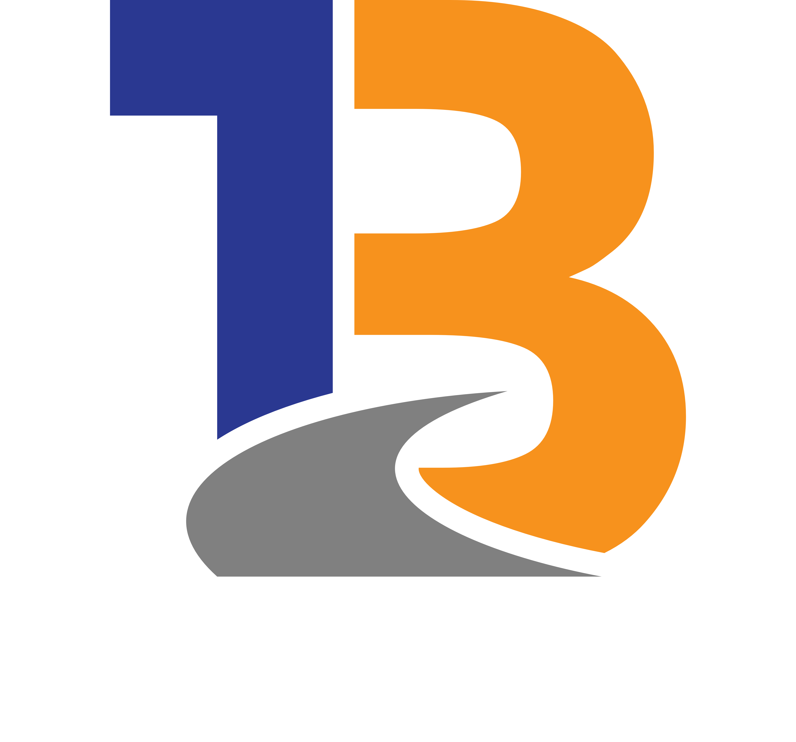

<div align="center">
  
  <h1>IT Asset Management & Monitoring Dashboard</h1>
  <p>
    A modern, full-stack application built with Next.js for managing and monitoring IT assets, network usage, and vouchers.
  </p>
  <p>
    <a href="#-key-features">Key Features</a> •
    <a href="#-tech-stack">Tech Stack</a> •
    <a href="#-getting-started">Getting Started</a> •
    <a href="#-environment-variables">Environment</a> •
    <a href="#-license">License</a>
  </p>
</div>

---

## ✨ Key Features

- **Authentication:** Secure JWT-based authentication (login/logout).
- **IT Asset Management:** CRUD functionality for managing IT equipment.
- **Asset Monitoring:** Dashboard for real-time asset status monitoring.
- **Voucher System:** Interface for managing and visualizing voucher data with charts.
- **Network Usage Insights:** Track and display Starlink internet usage statistics.
- **Responsive UI:** Modern and responsive user interface built with Shadcn/UI and Tailwind CSS.
- **Data Visualization:** Interactive charts for data analysis.
- **File Storage:** Integrates with S3-compatible object storage (e.g., Cloudflare R2) for file handling.

## 🛠️ Tech Stack

- **Framework:** [Next.js](https://nextjs.org/) (with Turbopack)
- **Language:** [TypeScript](https://www.typescriptlang.org/)
- **Database ORM:** [Drizzle ORM](https://orm.drizzle.team/)
- **Database:** [MySQL](https://www.mysql.com/)
- **Styling:** [Tailwind CSS](https://tailwindcss.com/)
- **UI Components:** [Shadcn/UI](https://ui.shadcn.com/)
- **Data Tables:** [TanStack Table](https://tanstack.com/table)
- **Form Management:** [React Hook Form](https://react-hook-form.com/) & [Zod](https://zod.dev/)
- **Authentication:** [JWT](https://jwt.io/) (using `jose` and `bcryptjs`)
- **Charts & Visualization:** [Recharts](https://recharts.org/)
- **File Storage:** AWS S3 SDK (for Cloudflare R2)

## 🚀 Getting Started

Follow these instructions to set up and run the project locally.

### Prerequisites

- [Node.js](https://nodejs.org/en/) (v20 or newer recommended)
- [pnpm](https://pnpm.io/installation) (or `npm`/`yarn`)
- A running MySQL database instance.

### 1. Clone the Repository

```bash
git clone <your-repository-url>
cd <repository-folder>
```

### 2. Install Dependencies

```bash
pnpm install
```
*(or `npm install` / `yarn install`)*

### 3. Set Up Environment Variables

Create a `.env.local` file in the root of the project and fill it with the necessary credentials. See the [Environment Variables](#-environment-variables) section for details.

### 4. Run Database Migrations

This project uses Drizzle ORM. You'll need to run migrations to set up the database schema.
*(Instructions on running migrations would go here - assuming a script exists like `pnpm run db:push` or `db:migrate`)*

```bash
# Example command (update with your actual migration script)
pnpm drizzle-kit push
```

### 5. Run the Development Server

```bash
pnpm dev
```

The application should now be running at [http://localhost:3000](http://localhost:3000).

## 🔒 Environment Variables

Create a file named `.env.local` in the project root and add the following variables. Replace the placeholder values with your actual configuration.

```plaintext
# Database Configuration
DB_HOST="127.0.0.1"
DB_PORT="3306"
DB_USER="your_db_user"
DB_PASSWORD="your_db_password"
DB_NAME="lma_db"

# Authentication
# Generate a secure, random string (e.g., using `openssl rand -base64 32`)
JWT_SECRET="your-super-secret-key-for-jwt"

# Cloudflare R2 (S3-Compatible Storage)
CLOUDFLARE_ACCOUNT_ID="your_cf_account_id"
CLOUDFLARE_ACCESS_KEY_ID="your_cf_access_key_id"
CLOUDFLARE_SECRET_ACCESS_KEY="your_cf_secret_access_key"

# External API Tokens
ACCESS_TOKEN_RUIJIE="your_ruijie_access_token"

# Node Environment
NODE_ENV="development"
```

## 📄 License

This project is licensed under the terms of the license agreement found in the [LICENSE](./LICENSE) file.
